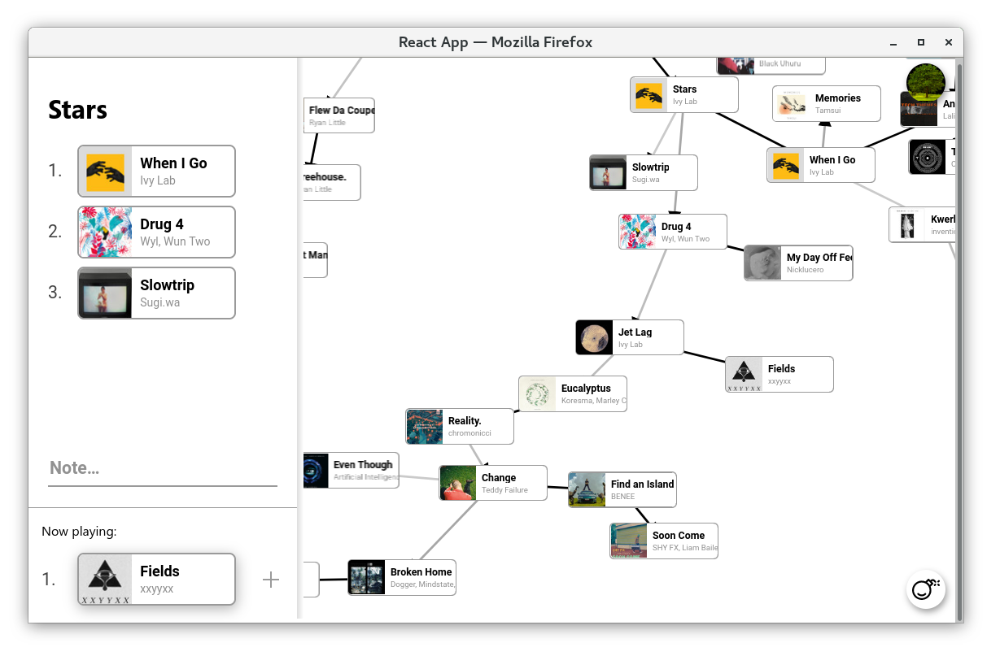

Allows you to arrange your songs into a mindmap, instead of a list.

Spotify aren't gonna let me publish this so you're going to have to [make your own Spotify client ID](https://developer.spotify.com/dashboard) and paste it into `src/AuthButtonSpotify.tsx`.